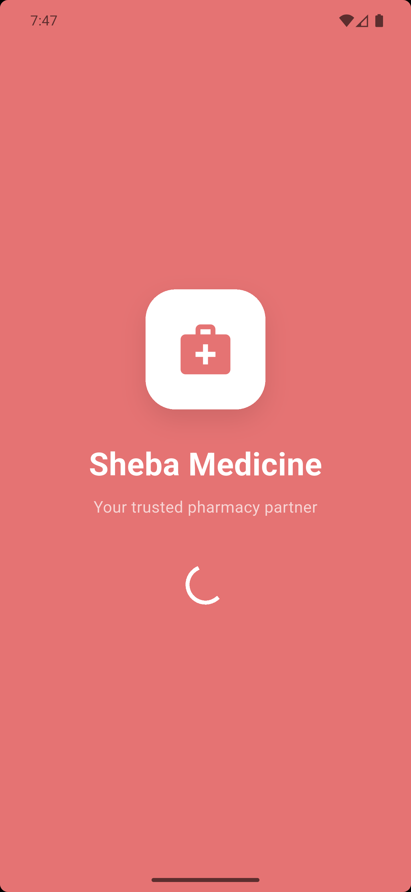
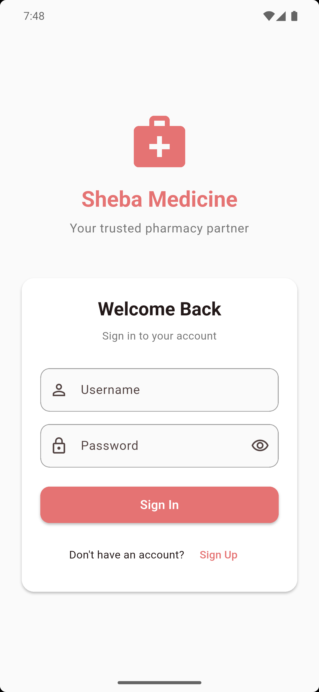
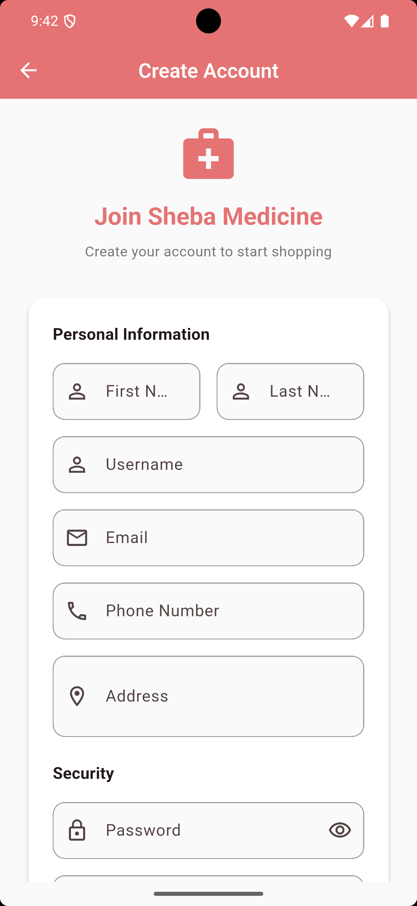
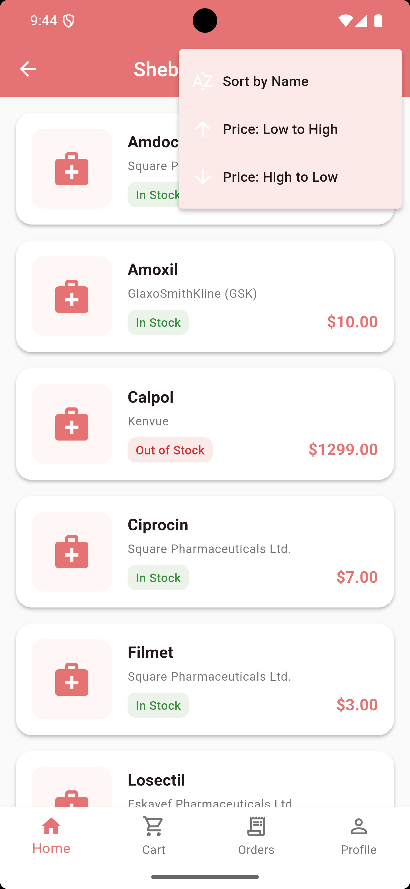
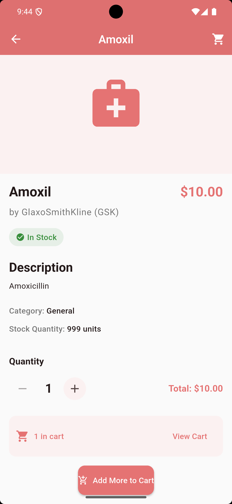
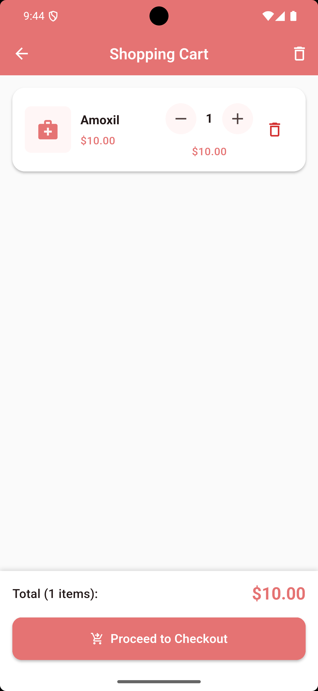
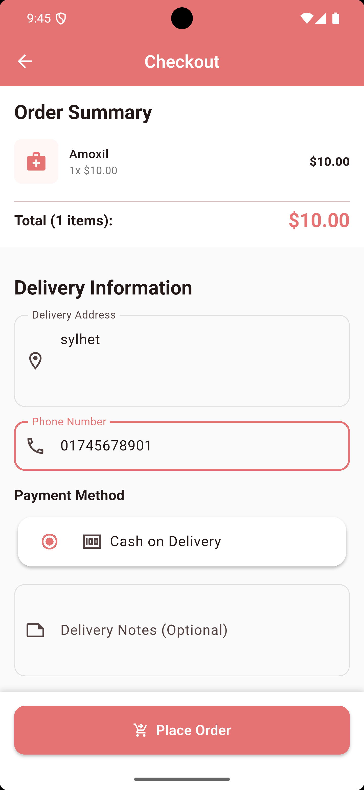
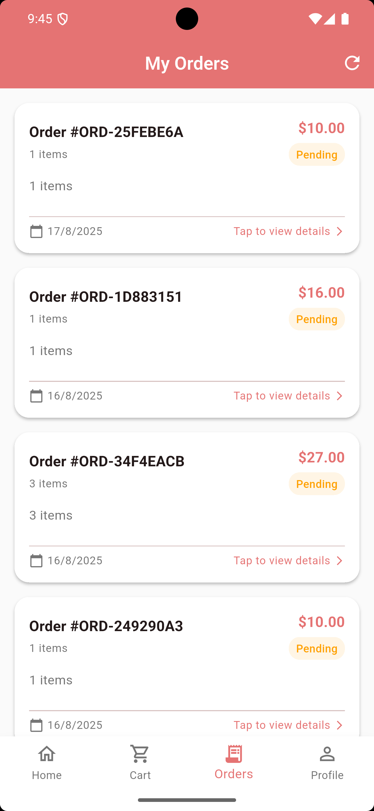
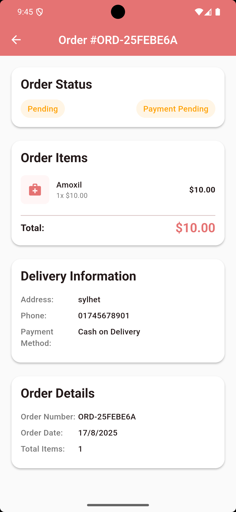
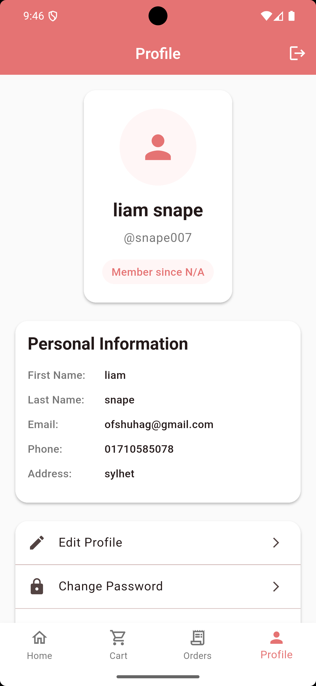

# Sheba Medicine - Flutter Pharmacy App

A modern, feature-rich pharmacy management mobile application built with Flutter. Sheba Medicine provides a comprehensive solution for browsing medicines, managing orders, and handling user authentication with a beautiful, intuitive interface.

## 📱 Features

### 🔐 Authentication
- User registration and login
- Secure token-based authentication
- Profile management
- Automatic session management

### 💊 Medicine Management
- Browse comprehensive medicine catalog
- Search medicines by name, category, or manufacturer
- Filter and sort medicines (by name, price, availability)
- Detailed medicine information including:
  - Pricing and stock availability
  - Manufacturer details
  - Prescription requirements
  - Expiry dates
  - Product images

### 🛒 Shopping Cart
- Add/remove medicines to cart
- Quantity management
- Real-time cart updates with badge notifications
- Cart persistence across sessions

### 📋 Order Management
- View order history
- Order status tracking
- Order details with medicine information
- Payment status monitoring

### 🎨 User Interface
- Modern Material Design 3
- Responsive layout
- Intuitive navigation with bottom navigation bar
- Beautiful color scheme with soft red primary color
- Loading states and error handling

## 🏗️ Architecture

The app follows a clean architecture pattern with feature-based organization:

```
lib/
├── core/
│   ├── models/          # Data models
│   ├── providers/       # State management
│   ├── services/        # API and business logic
│   └── theme/          # App theming
├── features/
│   ├── auth/           # Authentication feature
│   └── home/           # Main app features
└── main.dart           # App entry point
```

### State Management
- **Provider Pattern**: Used for state management across the app
- **ChangeNotifier**: For reactive UI updates
- **SharedPreferences**: For local data persistence

### API Integration
- RESTful API communication
- JWT token authentication
- Automatic token refresh
- Error handling and retry mechanisms

## 🛠️ Technology Stack

### Core Framework
- **Flutter**: 3.8.1+ (Dart SDK)
- **Material Design 3**: Modern UI components

### Dependencies
- **provider**: ^6.0.5 - State management
- **http**: ^1.1.0 - HTTP client for API calls
- **shared_preferences**: ^2.2.2 - Local data persistence
- **cupertino_icons**: ^1.0.8 - iOS-style icons

### Development Tools
- **flutter_lints**: ^5.0.0 - Code quality and style enforcement

## 📋 Prerequisites

Before running this application, make sure you have the following installed:

- **Flutter SDK**: 3.8.1 or higher
- **Dart SDK**: 3.0.0 or higher
- **Android Studio** or **VS Code** with Flutter extensions
- **Android SDK** (for Android development)
- **Xcode** (for iOS development, macOS only)
- **Git** for version control

## 🚀 Getting Started

### 1. Clone the Repository
```bash
git clone https://github.com/yourusername/sheba_medicine.git
cd sheba_medicine
```

### 2. Install Dependencies
```bash
flutter pub get
```

### 3. Configure API Endpoint
The app is configured to use the Sheba AI API endpoint. If you need to change the API endpoint, modify the `baseUrl` in:
```
lib/core/services/api_service.dart
```

### 4. Run the Application

#### For Android:
```bash
flutter run
```

#### For iOS (macOS only):
```bash
flutter run
```

#### For Web:
```bash
flutter run -d chrome
```

### 5. Build for Production

#### Android APK:
```bash
flutter build apk --release
```

#### Android App Bundle:
```bash
flutter build appbundle --release
```

#### iOS:
```bash
flutter build ios --release
```
## 📱 Screenshots

### Authentication Screens

<p align="center">
  &nbsp;&nbsp;&nbsp;
  &nbsp;&nbsp;&nbsp;
  
</p>
<p align="center">
  <em>Splash Screen</em>&nbsp;&nbsp;&nbsp;&nbsp;&nbsp;&nbsp;&nbsp;&nbsp;&nbsp;&nbsp;&nbsp;&nbsp;&nbsp;&nbsp;&nbsp;&nbsp;&nbsp;&nbsp;
  <em>Login Screen</em>&nbsp;&nbsp;&nbsp;&nbsp;&nbsp;&nbsp;&nbsp;&nbsp;&nbsp;&nbsp;&nbsp;&nbsp;&nbsp;&nbsp;&nbsp;&nbsp;&nbsp;&nbsp;&nbsp;&nbsp;&nbsp;&nbsp;&nbsp;&nbsp;
  <em>Registration Screen</em>
  
</p>

### Main App Screens

<p align="center">
  &nbsp;&nbsp;&nbsp;
  &nbsp;&nbsp;&nbsp;
  
</p>
<p align="center">
  <em>Medicine List</em>&nbsp;&nbsp;&nbsp;&nbsp;&nbsp;&nbsp;&nbsp;&nbsp;&nbsp;&nbsp;&nbsp;&nbsp;&nbsp;&nbsp;&nbsp;&nbsp;&nbsp;&nbsp;&nbsp;&nbsp;&nbsp;&nbsp;&nbsp;&nbsp;&nbsp;
  <em>Medicine Details</em>&nbsp;&nbsp;&nbsp;&nbsp;&nbsp;&nbsp;&nbsp;&nbsp;&nbsp;&nbsp;&nbsp;&nbsp;&nbsp;&nbsp;&nbsp;&nbsp;&nbsp;&nbsp;
  <em>Shopping Cart</em>
</p>

<p align="center">
  &nbsp;&nbsp;&nbsp;
  &nbsp;&nbsp;&nbsp;
  
</p>
<p align="center">
  <em>Checkout Screen</em>&nbsp;&nbsp;&nbsp;&nbsp;&nbsp;&nbsp;&nbsp;&nbsp;&nbsp;&nbsp;&nbsp;&nbsp;&nbsp;&nbsp;&nbsp;&nbsp;
  <em>Orders Screen</em>&nbsp;&nbsp;&nbsp;&nbsp;&nbsp;&nbsp;&nbsp;&nbsp;&nbsp;&nbsp;&nbsp;&nbsp;&nbsp;&nbsp;&nbsp;&nbsp;&nbsp;&nbsp;&nbsp;&nbsp;
  <em>Order Details</em>
</p>

<p align="center">
  
</p>
<p align="center">
  <em>Profile Screen</em>
</p>


## 🔧 Configuration

### API Configuration
The app connects to the Sheba AI backend API. The base URL is configured in `lib/core/services/api_service.dart`:

```dart
static const String baseUrl = 'https://shebaai.pythonanywhere.com/api';
```

### Theme Configuration
The app uses a custom theme defined in `lib/core/theme/app_theme.dart` with:
- Primary Color: Soft Red (#E57373)
- Secondary Color: Light Blue (#4FC3F7)
- Material Design 3 components

## 📁 Project Structure

```
lib/
├── core/
│   ├── models/
│   │   ├── cart_item_model.dart
│   │   ├── medicine_model.dart
│   │   ├── order_model.dart
│   │   └── user_model.dart
│   ├── providers/
│   │   ├── auth_provider.dart
│   │   ├── cart_provider.dart
│   │   ├── medicine_provider.dart
│   │   └── order_provider.dart
│   ├── services/
│   │   └── api_service.dart
│   └── theme/
│       └── app_theme.dart
├── features/
│   ├── auth/
│   │   └── presentation/
│   │       ├── screens/
│   │       │   ├── login_screen.dart
│   │       │   ├── register_screen.dart
│   │       │   └── splash_screen.dart
│   │       └── widgets/
│   │           └── auth_text_field.dart
│   └── home/
│       └── presentation/
│           ├── screens/
│           │   └── home_screen.dart
│           └── widgets/
│               ├── cart_screen.dart
│               ├── checkout_screen.dart
│               ├── medicine_detail_screen.dart
│               ├── medicine_list_screen.dart
│               ├── order_detail_screen.dart
│               ├── orders_screen.dart
│               └── profile_screen.dart
└── main.dart
```

## 🔍 Key Features Explained

### Authentication Flow
1. **Splash Screen**: Checks for existing authentication tokens
2. **Login/Register**: User authentication with API
3. **Token Management**: Automatic token refresh and session handling
4. **Profile Loading**: User profile data retrieval

### Medicine Browsing
1. **Pagination**: Efficient loading of medicine data
2. **Search**: Real-time search functionality
3. **Filtering**: Multiple filter options (category, price, availability)
4. **Sorting**: Sort by name, price (low to high, high to low)

### Shopping Cart
1. **Add to Cart**: One-click medicine addition
2. **Quantity Management**: Adjust medicine quantities
3. **Cart Persistence**: Cart data saved locally
4. **Real-time Updates**: Live cart badge updates

### Order Management
1. **Order History**: View all past orders
2. **Order Details**: Comprehensive order information
3. **Status Tracking**: Real-time order status updates
4. **Payment Status**: Payment confirmation tracking

## 🐛 Troubleshooting

### Common Issues

#### 1. API Connection Issues
- Verify the API endpoint is accessible
- Check network connectivity
- Ensure proper authentication tokens

#### 2. Build Issues
```bash
# Clean and rebuild
flutter clean
flutter pub get
flutter run
```

#### 3. Dependencies Issues
```bash
# Update dependencies
flutter pub upgrade
flutter pub get
```

#### 4. Platform-specific Issues

**Android:**
- Ensure Android SDK is properly configured
- Check `android/app/build.gradle` for proper configuration

**iOS:**
- Ensure Xcode is up to date
- Check iOS deployment target in `ios/Podfile`

## 🤝 Contributing

1. Fork the repository
2. Create a feature branch (`git checkout -b feature/amazing-feature`)
3. Commit your changes (`git commit -m 'Add some amazing feature'`)
4. Push to the branch (`git push origin feature/amazing-feature`)
5. Open a Pull Request

## 📄 License

This project is licensed under the MIT License - see the [LICENSE](LICENSE) file for details.

## 👥 Team

- **Developer**: [Your Name]
- **Design**: [Designer Name]
- **Backend**: Sheba AI Team

## 📞 Support

For support and questions:
- Create an issue in the GitHub repository
- Contact: [your-email@example.com]
- Documentation: [Link to documentation if available]

## 🔄 Version History

- **v1.0.0** - Initial release with core features
  - User authentication
  - Medicine browsing and search
  - Shopping cart functionality
  - Order management
  - Modern UI with Material Design 3

---

**Note**: This application is designed for educational and demonstration purposes. For production use, ensure proper security measures, API rate limiting, and compliance with healthcare regulations.
